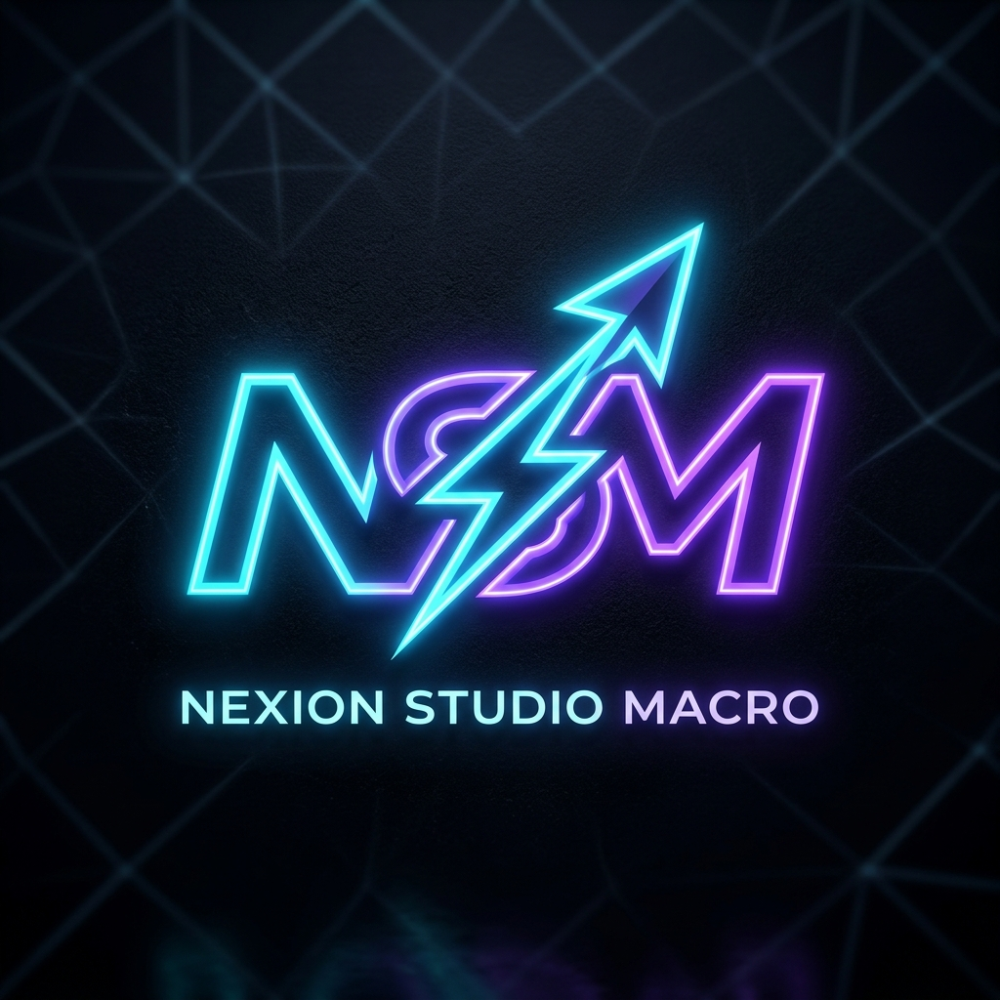

<div align="center">



# ⚡ NSM — Nexion Studio Macro

**Logiciel Windows professionnel, puissant et ultra-rapide pour la création de macros, autoclickers et simulations de frappes avancées.**

[](https://github.com/Nexion-Studio/NSM)
[](https://github.com/Nexion-Studio/NSM)
[](https://github.com/Nexion-Studio/NSM/releases)
[](LICENSE)

[📥 Télécharger l'Installeur Officiel (NSM_Setup.exe)](https://github.com/Nexion-Studio/NSM/releases/latest) • [✨ Fonctionnalités](#-fonctionnalités-principales) • [🚀 Installation](#-installation--utilisation) • [🛠️ Compilation](#-compilation-depuis-les-sources)

</div>

---

## 🌟 Aperçu

**NSM (Nexion Studio Macro)** a été conçu pour offrir des performances maximales sans compromis :
- **Précision sub-milliseconde** : Moteur natif Windows Win32 `SendInput` avec scan-codes matériels directs (compatible avec les jeux DirectX, RawInput, Minecraft, FPS, MMORPG et logiciels de bureau).
- **Raccourcis globaux non bloquants** : Déclenchez et stoppez vos macros même en étant dans un jeu en plein écran.
- **Support multi-macro simultané** : Activez plusieurs macros différentes en même temps en toute fluidité (ex: une macro qui maintient `Shift` pendant qu'une autre spamme le clic gauche).
- **Sécurité Arrêt d'Urgence (Killswitch)** : Touche dédiée (`F10` par défaut) coupant instantanément toutes les macros et relâchant immédiatement toutes les touches pressées.
- **Interface Cyberpunk Futuriste** : Design sombre néon glassmorphism, retour sonore synthétique via Web Audio API, indicateur CPS en temps réel et réglages intuitifs.

---

## ✨ Fonctionnalités Principales

### 1. ⚡ Spam / Autoclicker Ultra-Rapide
- **Cible personnalisable** :
  - **Souris** : Clic Gauche, Clic Droit, Clic Molette, Bouton 4 (Précédent), Bouton 5 (Suivant), Double Clic.
  - **Clavier** : N'importe quelle touche (Espace, Entrée, Shift, Ctrl, F1-F12, A-Z, 0-9, etc.).
- **Vitesse ajustable** : De 1ms (jusqu'à 1000 clics/sec) à plusieurs secondes ou minutes.
- **Préréglages CPS express** : 5 CPS, 10 CPS, 20 CPS, 50 CPS, 100 CPS, Vitesse MAX.
- **Jitter Aléatoire (Anti-Détection)** : Fluctuation humaine configurable de 0% à 50% pour contourner les systèmes anti-cheat et bots-checkers.
- **Modes d'exécution** :
  - *Bascule (Toggle)* : Appui sur le raccourci pour démarrer, nouvel appui pour arrêter.
  - *Maintien (Hold to Run)* : Spam tant que la touche de raccourci reste physiquement enfoncée.
  - *Nombre fixe de répétitions* (ex: 50 clics).
  - *Chronomètre* (ex: exécuter pendant 15 secondes).

### 2. ⏳ Appui Prolongé (Hold Key)
- Permet de maintenir une touche enfoncée pendant une durée précise (ex: 3 secondes, 10 secondes).
- Configuration du délai de relâchement avant répétition.
- Mode en boucle continue ou appui unique.
- Idéal pour les courses automatiques, le minage continu, les tirs chargés ou l'AFK anti-kick.

### 3. 🚀 Système de Mise à Jour Automatique (Auto-Updater)
- **Détection automatique GitHub** : Le logiciel vérifie automatiquement à l'ouverture si une nouvelle version est disponible sur le dépôt GitHub officiel.
- **Mise à jour en 1 clic** : Téléchargement automatique de l'installeur en arrière-plan avec barre de progression en temps réel, installation silencieuse et redémarrage automatique. Aucun téléchargement manuel requis !

### 4. 🎯 Zone de Test & Benchmark CPS Intégrée
- Permet de tester vos macros et mesurer votre CPS réel (clics par seconde) directement dans l'application avec un pavé interactif et un historique des pics de vitesse.

### 5. 🛡️ Arrêt d'Urgence & Sécurité Anti-Répétition
- **Filtrage anti-rebond (Debounce)** : Élimine les répétitions automatiques intempestives du clavier Windows afin que le mode Bascule (On/Off) reste parfaitement stable.
- **Touche d'urgence Killswitch (F10)** : Remise à zéro immédiate de l'état des touches pour empêcher tout blocage ou bug clavier.

### 6. 🎛️ Modèles Prédéfinis Intégrés (Nexion Studio)
L'application intègre dès le premier lancement des modèles prêts à l'emploi :
- ⚡ **Autoclicker Souris Gauche (50 CPS)** — `[F6]`
- 🎯 **Spam Humain Anti-Détection (~14 CPS + Jitter)** — `[F7]`
- 🏃 **Appui Prolongé Shift (Sprint / Sneak continu)** — `[F8]`
- ⌨️ **Spam Touche E (Loot / Interaction Rapide)** — `[F9]`
- 🦘 **AFK Anti-Kick (Saut toutes les 45s)** — `[F4]`

---

## 🚀 Installation & Utilisation

### 📦 Installation Officielle Windows

1. Téléchargez **`NSM_Setup.exe`** depuis l'onglet [Releases](https://github.com/Nexion-Studio/NSM/releases).
2. Lancez l'installeur :
   - Choisissez l'installation avec ou sans droits administrateur.
   - L'installeur crée automatiquement un **raccourci sur votre Bureau** et dans le **Menu Démarrer**.
3. Lancez **NSM** depuis votre Bureau !
4. L'application dispose également d'un désinstalleur officiel intégré sous Windows (Paramètres > Applications).

---

## 🏗️ Structure du Projet

```
NSM/
├── assets/
│   ├── logo.png             # Logo haute résolution Nexion Studio Macro
│   └── logo.ico             # Icône multi-résolution Windows (16x16 à 256x256)
├── src/
│   ├── __init__.py
│   ├── win_input.py         # Moteur Win32 SendInput (scancodes matériels)
│   ├── macro_engine.py      # Gestionnaire multithread de macros concurrentes
│   ├── hotkey_listener.py   # Écouteur global de raccourcis clavier
│   └── app_api.py           # Passerelle API Python <-> UI Webview
├── web/
│   ├── index.html           # Interface Cyberpunk Studio
│   ├── styles.css           # Thème dark glassmorphism & néon
│   └── app.js               # Contrôleur JS & synthétiseur Web Audio
├── .github/workflows/
│   └── build-release.yml    # Pipeline CI/CD GitHub Actions
├── main.py                  # Point d'entrée de l'application
├── installer.iss            # Script de compilation Inno Setup
├── build.py                 # Script de build automatisé
└── README.md
```

---

## 🛠️ Compilation depuis les sources

Si vous souhaitez modifier le code ou recompiler les fichiers `.exe` vous-même :

### Prérequis
- Python 3.10 ou supérieur
- Inno Setup 6 (`winget install JRSoftware.InnoSetup`)
- Git

### Étapes
```bash
# 1. Cloner le dépôt
git clone https://github.com/Nexion-Studio/NSM.git
cd NSM

# 2. Installer les dépendances Python
pip install pyinstaller pywebview pythonnet pynput pillow

# 3. Lancer la compilation complète (Génère NSM.exe et NSM_Setup.exe)
python build.py
```

Le script `build.py` produit directement :
- `dist/NSM/NSM.exe` : L'exécutable portable
- `dist_installer/NSM_Setup.exe` : L'installeur officiel Windows avec raccourcis et désinstalleur.

---

## 📄 Licence

Distribué sous licence MIT. Développé avec passion pour **Nexion Studio**.
